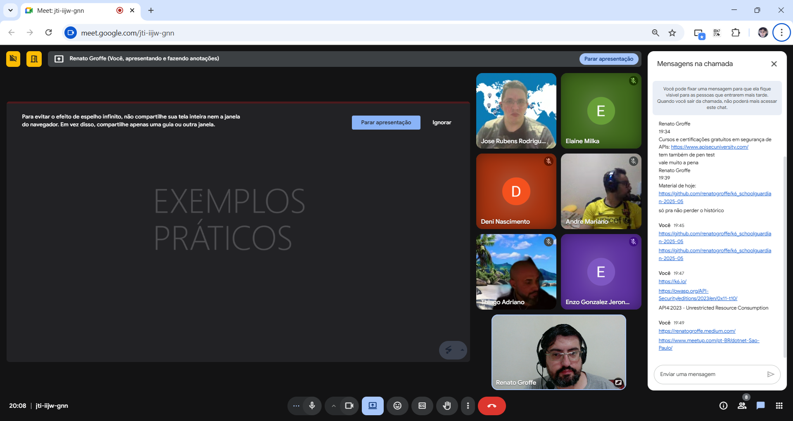

# k6_schoolguardian-2025-05
Conteúdos de apresentação sobre testes de carga com k6 (incluindo o uso de containers) realizada no dia 16/05/2025.

Links importantes:
- Pipeline k6 - teste de API protegida: https://github.com/renatogroffe/k6-LoadTests-Reports-JUnit-JWT-AzureDevOps_ContagemAcessos
- Dados fake com k6: https://faker.x.k6.io/index.html
- k6 + MySQL: https://github.com/renatogroffe/k6-MySql-LoadTests-AzureDevOps-Pipelines
- k6 + PostgreSQL: https://github.com/renatogroffe/k6-Postgres-LoadTests-AzureDevOps-Pipelines
- grafana/xk6 Docker image: https://hub.docker.com/r/grafana/xk6

---

## Informações sobre o evento

Título da apresentação: **k6: descomplicando seus testes de carga e de performance**

Data: **16/05/2025 (sexta-feira)**

Tipo do evento: **Online**

Ferramenta de transmissão: **Google Meet**

Tecnologias e tópicos abordados: **k6, JavaScript, Docker, Docker Hub, Azure DevOps, Azure Pipelines, Linux, Git, PostgreSQL, MySQL, .NET, ASP.NET Core, JWT, Go...**

Número de participantes: **7 pessoas**

Deixo aqui meus agradecimentos aos amigos **José Rubens Rodrigues** e **Thiago Adriano** por todo o apoio para que eu participasse deste evento interno da [**School Guardian**](https://www.linkedin.com/company/schoolguardian/?originalSubdomain=br).

---

